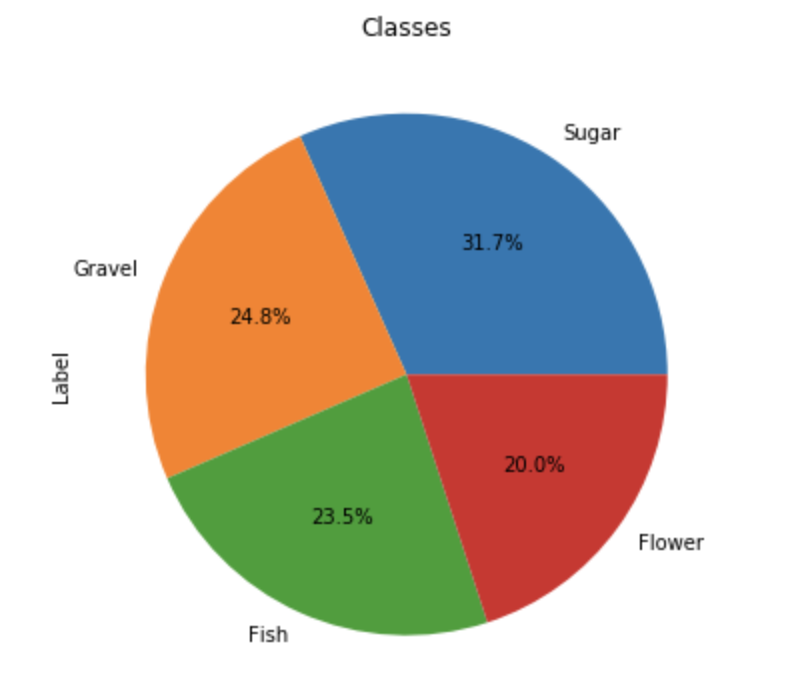
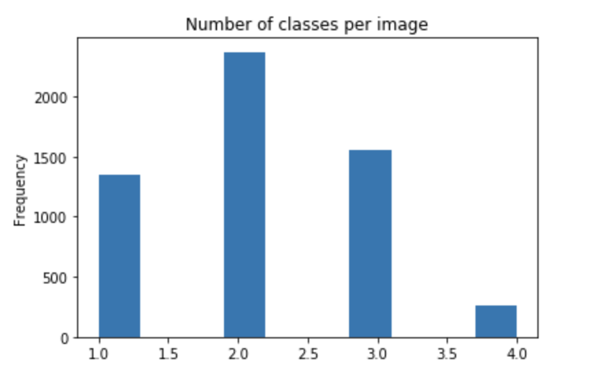
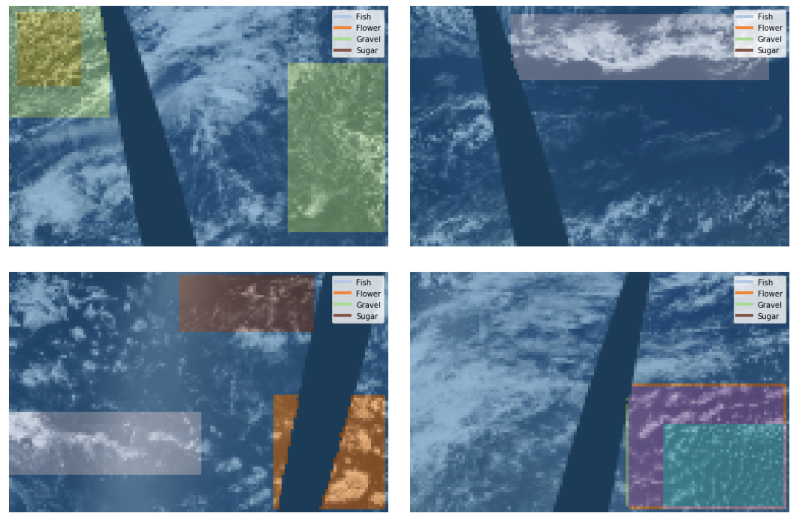
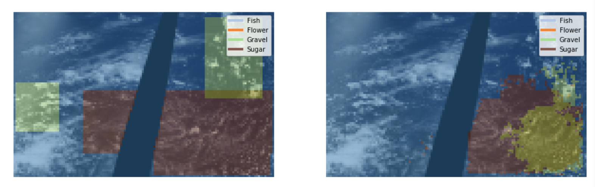
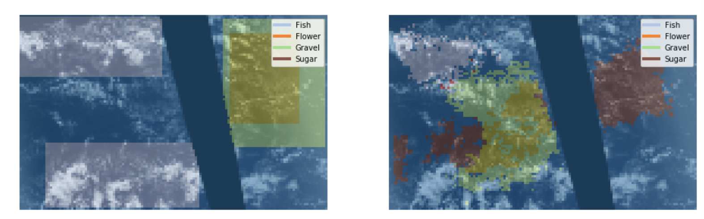
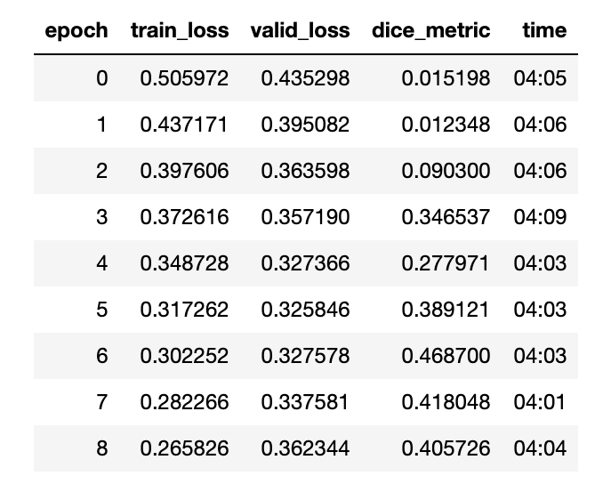

# Understanding Clouds From Satellite Images

The purpose of this project is to segment and classify images of clouds. After cleaning the data and segmenting the images, we will use [FastAI](https://www.fast.ai/) to create a convolutional neural network in order to model the data.

### Data

The data was sourced from [Kaggle](https://www.kaggle.com/c/understanding_cloud_organization/overview). The data in this dataset was actually crowdsourced, as described in this [paper](https://arxiv.org/abs/1906.01906). Four patterns of recognition were defined: Sugar, Flower, Fish, and Gravel. 67 scientists then screened 10,000 images to come up with the final dataset (about 9,000 images). Humans are much better than computers at recognizing patterns, especially for something so subjective as cloud patterns, which is why this method was used to come up with the training dataset.

### Dependencies

This project uses:
* Keras 2.3.1
* Tensorflow 2.0
* PyTorch 1.3.0
* FastAI 1.0.59
* Matplotlib 3.1.1
* Pandas 0.25.1

### Process

1. Data cleaning
2. Image segmentation
3. Modeling

### Data cleaning/Image segmentation

We can see that the 4 classes are pretty evenly balanced, which is good if we want accurate results.

We can also see that most images have at least 2 classes, which means that they will need to be segmented before we can run the model.

To segment the images, I used a function from a [Kaggle kernel](https://www.kaggle.com/alt250/multi-label-segmentation-using-fastai). After applying the function:

As you can see, we did an okay job at segmenting the images. Now we can use them to train our model.

### Modeling

In creating the model, I used a technique called transfer learning, where a model that has been previously trained is applied to your dataset. In this case, I used [ResNet-18](https://www.mathworks.com/help/deeplearning/ref/resnet18.html), which was trained on more than a million images from the ImageNet database. ‘18’ refers to the number of layers. After training the model, these are the resultant images:

Once again, our model did alright, but at a glance we can see that it’s not as accurate as our training images. To quantify our prediction, we use something called the [Dice coefficient](https://en.wikipedia.org/wiki/S%C3%B8rensen%E2%80%93Dice_coefficient), which measures the similarity between images. In this case, for example, it compares the classes from test images with the same class from the training images.

Our best score was 0.469, which is okay, but there is room for improvement.

We can see that it is certainly possible for a machine to learn how to perform subjective tasks like classifying images of clouds, but there is a lot of work to be done.

### Future work

* Optimize current model
* Experiment with different deep learning libraries